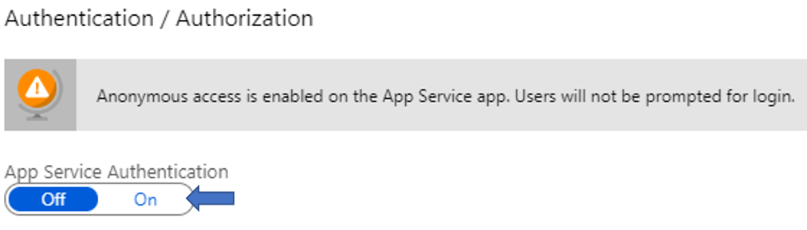
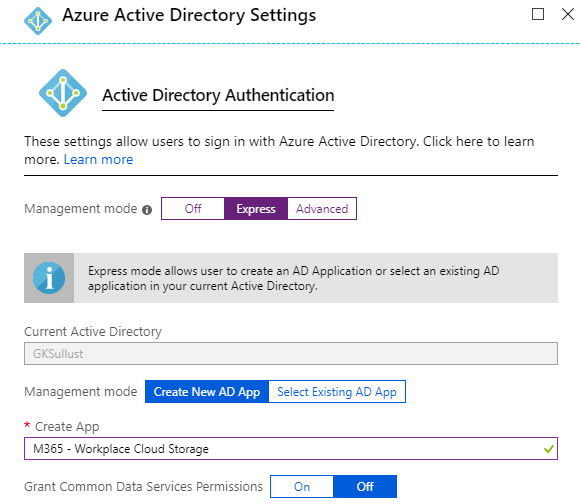

# gk-m365-workplacecloudstorage
M365 Workplace Cloud Storage Spec

## Deployment

## Enabling Easy Auth (Azure AD authentication)
- Open [Azure Portal](https://www.portal.azure.com) and navigate to the deployed **M365 Workplace Cloud Storage** app service. 
- Select **Authentication / Authorization** under **Settings** and enable **App Service Authentication**.
- Set **Action to take when request is not authenticated** to **Log in with Azure Active Directory**.
- 
- Configure **Azure Active Directory** as the **Authentication Provider**
    - Set **Management mode** to **Express**.
    - Create a new AD App or select an existing if you have registeres an AD App for **M365 Workplace Cloud Storage**
    - 
- Save the changes